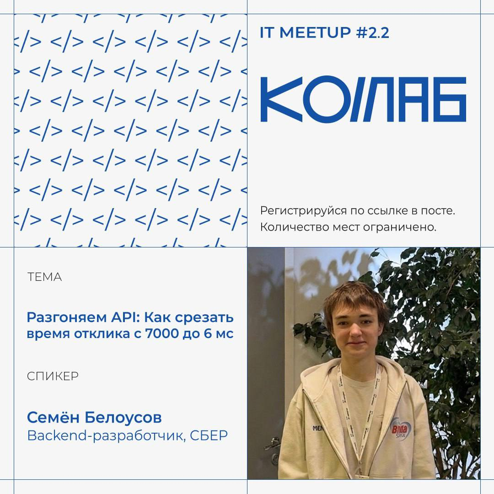
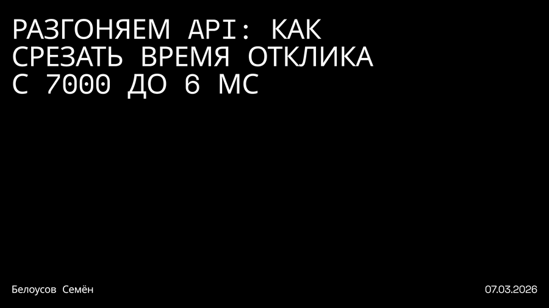

# cache-example

Демо-стенд для доклада **«Разгоняем API: как срезать время отклика с 7000 до 6 мс»** (митап, 07.03.2026) — сравнение трёх стратегий кэширования на одном и том же тяжёлом запросе к БД.

🎤 Доклад представлен на **IT Meetup #2.2 (КОЛЛАБ)**.

<p align="center">
  
</p>

<p align="center">
  
</p>

📄 [Слайды доклада (PDF)](assets/presentation.pdf)

## Что демонстрируется

Один и тот же endpoint (получение продукта), но с искусственно замедленным SQL-запросом (`CROSS JOIN generate_series(1, 50000)` + сортировка по `MD5`), чтобы честно сравнить:

| Endpoint | Стратегия | Источник данных |
| --- | --- | --- |
| `GET /api/Products/{id}/nocache` | Без кэша | Всегда PostgreSQL |
| `GET /api/Products/{id}/redis` | Только L2 (Redis), Cache-Aside вручную | Redis → PostgreSQL при промахе |
| `GET /api/Products/{id}/hybrid` | L1 (in-memory) + L2 (Redis) через `HybridCache` | L1 → L2 → PostgreSQL |

`hybrid`-вариант использует встроенный в .NET `HybridCache`, который сам защищает от Cache Stampede (эффект "громового стада") и координирует L1/L2 — это и есть архитектурный вывод доклада: не писать защиту от stampede руками, если можно взять готовое.

## Результаты нагрузочного теста (k6, 500 VU)

Два сценария: один хот-ключ (как на докладе) и 100 разных товаров (более реалистичный hit ratio).

**Сценарий 1 — один товар:**

| Режим | RPS | Latency p(95) |
| --- | --- | --- |
| Без кэша | 73/s | 7.25s |
| Redis (L2) | 3690/s | 16.84ms |
| Hybrid (L1+L2) | 3880/s | **5.76ms** |

**Сценарий 2 — 100 разных товаров:**

| Режим | RPS | Latency p(95) |
| --- | --- | --- |
| Без кэша | 87/s | 6.16s |
| Redis (L2) | 3703/s | 18.99ms |
| Hybrid (L1+L2) | 3902/s | **6.65ms** |

## Стек

ASP.NET Core, EF Core + PostgreSQL, Redis (`StackExchange.Redis`), `Microsoft.Extensions.Caching.Hybrid`, Docker Compose, k6 (нагрузочное тестирование)

## Запуск

```bash
docker compose up -d          # Postgres + Redis
cd CacheExample
dotnet ef database update     # накатить миграции
dotnet run
```

## Нагрузочный тест

```bash
cd LoadTest

# сценарий 2 — 100 разных товаров (по умолчанию)
k6 run -e MODE=nocache -e VUS=500 test.js
k6 run -e MODE=redis   -e VUS=500 test.js
k6 run -e MODE=hybrid  -e VUS=500 test.js

# сценарий 1 — один хот-ключ
k6 run -e MODE=hybrid -e VUS=500 -e KEYS=1 test.js
```

## Архитектурные грабли, разобранные в докладе

- **Cache Stampede** — при промахе кэша множество параллельных запросов одновременно бьют в БД. `HybridCache` решает это блокировкой потоков на уровне ключа (request coalescing из коробки).
- **Рассинхронизация L1 (stale data)** — при нескольких инстансах API у каждого свой L1-кэш в памяти; инвалидация одного инстанса не долетает до остальных. Решается через Redis Pub/Sub как брокер инвалидации между инстансами.
